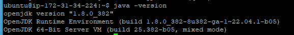

# EC2에 Jenkins 설치하기

## 0. 인스턴스 생성

## 1. EC2 접속 (PUTTY)

## 2. 윈도우 Jenkins 설치

- [Jenkins](https://www.jenkins.io/)

- [JDK](https://adoptium.net/)

- [접속](http://localhost:8080/)
  
  - 초기 비밀번호 키 값에 접속 후 입력

## 3. 젠킨스 프로젝트 생성 및 빌드 코드 짜기

- 인증 정보 설정

- 

## 4. EC2 젠킨스 배포

- Java 8 설치

```bash
$ sudo apt-get update
$ sudo apt install openjdk-8-jdk openjdk-8-jre
```

- 설치 확인

```bash
$ java -version
```



- 레포지토리 리스트를 텍스트 편집기로 연다

```bash
$ sudo vim /etc/apt/sources.list
```


